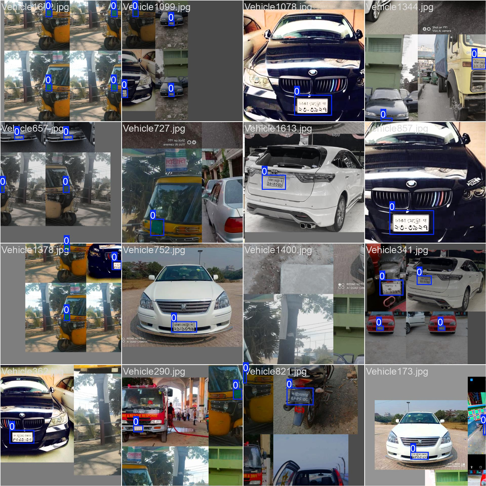

# 📑 Bangla Number Plate OCR Detection

This project uses **YOLOv8** + **EasyOCR** + **Streamlit** to detect and
recognize Bangla number plates from images and videos.

## 🚀 Features

-   YOLOv8 for number plate detection\
-   EasyOCR for Bangla text recognition\
-   Streamlit web interface\
-   Supports **images** & **videos**\
-   Filters valid Bangla districts, characters, and digits\
-   Download results as CSV

------------------------------------------------------------------------

## ⚙️ Installation

### 1️⃣ Create Conda Environment

``` bash
conda create -n ocrenv python=3.10 -y
conda activate ocrenv
```

### 2️⃣ Install Dependencies

``` bash
pip install streamlit easyocr ultralytics opencv-python pandas pillow
```

------------------------------------------------------------------------

## ▶️ Run the App

``` bash
streamlit run app.py
```

------------------------------------------------------------------------

## 📂 Project Structure

    📁 Bangla-OCR
    │── app.py                # Streamlit UI
    │── best.pt               # YOLOv8 trained weights
    │── args.yaml             # Training config
    │── car_number_plate_detect.ipynb   # Training notebook
    │── results.csv           # Example output
    │── images/               # Training & validation results
    │    ├── BoxF1_curve.png
    │    ├── BoxPR_curve.png
    │    ├── confusion_matrix.png
    │    ├── confusion_matrix_normalized.png
    │    ├── results.png
    │    └── ...

------------------------------------------------------------------------

## 📊 Training Results

### 🔹 Precision-Recall Curve


### 🔹 F1 Curve


### 🔹 Confusion Matrix


### 🔹 Normalized Confusion Matrix


------------------------------------------------------------------------

## 🖥️ Usage

-   Upload an **image** or **video** of a Bangla number plate\
-   YOLOv8 detects the plate → EasyOCR extracts Bangla text\
-   Results are filtered to match valid districts, letters & digits\
-   Export as **CSV**

------------------------------------------------------------------------

## 📸 Example



------------------------------------------------------------------------

## 📜 License

MIT License -- free to use and modify.
